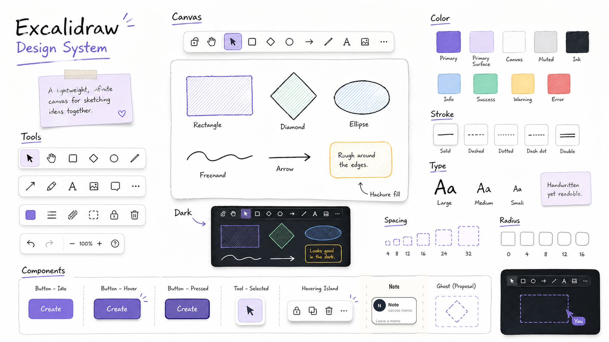

# Design System

## Overview

Excalidraw Agent Canvas should feel like a lightweight shared sketching surface, not a conventional SaaS dashboard. The product sits on top of Excalidraw, so the first visual responsibility is to preserve the calm, hand-drawn, infinite-canvas character of Excalidraw itself.

The UI should be quiet, spatial, and tactile: floating islands, compact tool controls, soft borders, subtle shadows, purple selection accents, handwritten diagram content, and practical agent state indicators. The agent-specific UI must feel like it belongs to the canvas rather than like a separate app shell.



Existing Excalidraw components should be customized through Excalidraw's official CSS variable surface. Do not override internal DOM structure or brittle class names when a documented CSS variable can express the change. Custom application components around Excalidraw should use Tailwind-friendly tokens from this document.

## Colors

- **Primary Purple** (`#6965db`): selected tools, primary commands, active agent affordances, and the strongest brand accent.
- **Primary Surface** (`#e0dfff` / `#e3e2fe`): selected states, ghost-highlight backgrounds, hover emphasis, and soft purple panels.
- **Canvas White** (`#ffffff`): the main drawing surface and default floating island background.
- **Ink** (`#121212`): diagram strokes, high-emphasis labels, and default hand-drawn marks.
- **Surface High/Mid/Low** (`#f1f0ff`, `#f2f2f7`, `#ececf4`): subtle layers behind controls, hover states, and inactive fills.
- **Muted Gray** (`#b8b8b8`): secondary metadata, disabled affordances, and low-emphasis dividers.
- **Info Blue** (`#1e88e5`): proposed agent work and additive ghost previews.
- **Success Green** (`#2b8a3e`): applied or verified agent states.
- **Warning Yellow** (`#f5c354`): queued/running/applying states and sticky-note warmth.
- **Error Red** (`#d32f2f`): failed/conflicted states and destructive proposal markers.

For Excalidraw itself, customize the documented variables on a scoped wrapper:

```css
.excalidraw-agent .excalidraw {
  --color-primary: #6965db;
  --color-primary-darker: #5b57d1;
  --color-primary-darkest: #4a47b1;
  --color-primary-light: #e3e2fe;
}

.excalidraw-agent .excalidraw.theme--dark {
  --color-primary: #a8a5ff;
  --color-primary-darker: #b2aeff;
  --color-primary-darkest: #beb9ff;
  --color-primary-light: #4f4d6f;
}
```

## Typography

Use two typographic voices:

- **Canvas voice**: handwritten and approachable. Use Excalifont-compatible families for diagram labels, empty-state sketches, annotations, and design-system imagery.
- **Product UI voice**: compact and readable. Use Assistant, Inter, or system sans for application chrome, status bars, buttons, metadata, and form controls.

Avoid oversized marketing typography inside the app. The primary surface is a tool, so labels should be short and controls should stay compact. Reserve handwritten display text for canvas-like artifacts and explanatory diagrams, not dense UI panels.

## Layout

The layout is full-bleed canvas first.

- Let Excalidraw occupy the viewport edge to edge.
- Put custom controls in Excalidraw's provided extension points, especially `Footer`, rather than adding unrelated page chrome.
- Keep app-specific UI in small floating islands with 8px radius, 1px borders, and soft shadows.
- Use an 8px-derived spacing rhythm: 4, 8, 12, 16, 24, and 32px.
- Prefer inline status chips and icon buttons over large panels.
- Keep toolbars stable in size; hover or state changes must not shift layout.

Tailwind implementation should map tokens directly:

```js
// tailwind.config excerpt
theme: {
  extend: {
    colors: {
      primary: "#6965db",
      "primary-surface": "#e0dfff",
      canvas: "#ffffff",
      surface: "#ffffff",
      "surface-high": "#f1f0ff",
      ink: "#121212",
      info: "#1e88e5",
      success: "#2b8a3e",
      warning: "#f5c354",
      error: "#d32f2f",
      sticky: "#fff3bf",
      ghost: "#8f86ff"
    },
    borderRadius: {
      sm: "4px",
      md: "6px",
      lg: "8px",
      xl: "12px"
    },
    spacing: {
      xs: "4px",
      sm: "8px",
      md: "12px",
      lg: "16px",
      xl: "24px",
      "2xl": "32px"
    }
  }
}
```

## Elevation & Depth

Depth should be functional and light. Floating islands may use Excalidraw's own `--shadow-island` or a similarly soft shadow. Avoid heavy card stacks, glassmorphism, glossy surfaces, and strong gradients.

Canvas content should communicate depth primarily through stroke weight, hachure fill, opacity, dashed outlines, and spatial grouping. Custom app UI should use borders and tonal surfaces before shadows.

Dark mode should keep the canvas preview legible: charcoal surfaces, pale purple active states, and bright but not neon strokes. Do not invert the product into a saturated dark dashboard.

## Shapes

The shape language is slightly soft and hand-drawn.

- Use 8px radius for most floating controls and custom buttons.
- Use 6px radius for compact internal buttons and segmented controls.
- Use 4px radius for sticky notes and small affordances.
- Use `999px` only for dots, pills, and presence/status indicators.
- Do not mix very sharp enterprise-style panels with playful canvas elements.

For diagram and proposal elements:

- Add/update ghost proposals should use dashed blue or purple strokes with reduced opacity.
- Delete proposals should use red dashed strokes and low opacity.
- Sticky notes should use warm yellow fills and compact handwritten text.
- Agent instruction notes should look temporary and human, not like permanent app chrome.

## Components

### Excalidraw Native Components

Customize native Excalidraw styling only through the documented CSS variable layer where possible. Use scoped selectors such as `.excalidraw-agent .excalidraw` and `.excalidraw-agent .excalidraw.theme--dark`.

Most Excalidraw internals should remain visually native: tool buttons, color pickers, shape controls, menus, and canvas behaviors should continue to feel like Excalidraw.

### Custom Tailwind Components

- **Agent footer status**: a compact floating island with inline status dot, short label, optional metadata, and one icon button. Use `surface`, `border`, `shadow`, `label-md`, and 8px radius.
- **Agent status dot**: 8px circle. Use warning for queued/running/applying, info for proposed, success for applied, and error for failed/conflicted.
- **Instruction note button**: 24px icon button, transparent by default, `surface-high` on hover, `primary-light` when pressed.
- **Ghost proposal preview**: dashed border, reduced opacity, locked visual feel, and a color keyed to operation type.
- **Sticky note**: `sticky` background, ink text, low-radius corners, no heavy shadow, small folded-corner detail only when it does not distract.
- **Dialogs or future side panels**: restrained and utilitarian. They may be denser than landing pages, but must still use the canvas palette and avoid nested cards.

## Do's and Don'ts

- Do preserve Excalidraw's hand-drawn whiteboard identity as the dominant experience.
- Do use official Excalidraw CSS variables for native component customization.
- Do use Tailwind tokens for custom application UI outside Excalidraw internals.
- Do keep agent UI compact, readable, and anchored to real workflow state.
- Do use dashed outlines, hachure fills, and opacity to distinguish proposal/ghost states.
- Don't build a separate dashboard shell around the canvas.
- Don't override brittle Excalidraw internal DOM classes for broad theming.
- Don't use large decorative gradients, bokeh, or glossy 3D treatments.
- Don't make custom controls shift size between idle, hover, selected, and pressed states.
- Don't let custom panels obscure active canvas work unless the user explicitly opened them.
