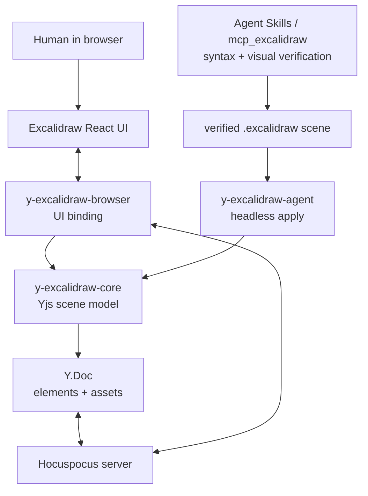

# y-excalidraw package architecture

## 目的

Excalidraw Agent では、ブラウザ上の人間操作と、headless agent が作成・検証した `.excalidraw` scene の両方を、同じYjs documentへ安全に反映する必要がある。

既存の `y-excalidraw` 系実装は、Excalidraw React UIとYjsを直接つなぐbrowser bindingとしては有用だが、agentがheadlessにYjsを書き換えるための明示的なAPIを持たない。そのため、UI binding、Yjs document操作、agent適用処理を分けて設計する。

## パッケージ構成

初期実装から3パッケージに分ける。1パッケージ + subpath exports にはしない。

```text
packages/
  y-excalidraw-core/
  y-excalidraw-browser/
  y-excalidraw-agent/
```

```text
@excalidraw-agent/y-excalidraw-core
@excalidraw-agent/y-excalidraw-browser
@excalidraw-agent/y-excalidraw-agent
```

依存関係は一方向にする。

```text
browser -> core
agent   -> core
core    -> yjs, fractional-indexing, Excalidraw types
```

`core` はbrowserにもagentにも依存しない。`browser` と `agent` も互いに依存しない。

3パッケージに分ける理由:

- agent実行環境へReact/Excalidraw UI依存を持ち込まない。
- `core` がheadlessに使えることをpackage boundaryで保証する。
- `browser` がagent helperへ依存したり、`agent` がbrowser callbackへ依存したりする事故を防ぐ。
- 各packageのpeer dependencyとruntime dependencyを正確にできる。
- CIで `core` / `browser` / `agent` を個別にtypecheck/testできる。
- 将来外部公開する場合も、利用者が必要な面だけ導入できる。

各packageの依存方針:

| Package | Runtime deps | Peer deps | 禁止 |
| --- | --- | --- | --- |
| `y-excalidraw-core` | `yjs`, `fractional-indexing` | `@excalidraw/excalidraw` types only if needed | React, DOM, awareness, filesystem |
| `y-excalidraw-browser` | `@excalidraw-agent/y-excalidraw-core`, `y-protocols` | `@excalidraw/excalidraw`, `react`, `yjs` | filesystem, agent package |
| `y-excalidraw-agent` | `@excalidraw-agent/y-excalidraw-core` | `yjs` | React, DOM, browser package |

`core` がExcalidrawの型だけを使う場合、runtime importにならないよう `import type` に限定する。

## 全体像



agentの方式は、`.excalidraw` ファイルを作ってAgent Skillsや `mcp_excalidraw` で構文的・視覚的に検証し、検証済みsceneをYjsへ反映する方針でよい。この設計はその方式を変えるものではない。追加するのは、最後の「検証済みsceneをYjsへ反映する」部分を、browser bindingの内部実装ではなく共有APIとして扱うことである。

## y-excalidraw-core

`core` はYjs上のExcalidraw document modelを読み書きする。ブラウザcallback、React、awareness、特定のagent runtime SDK、ファイルシステムには依存しない。

責務:

- Yjs schemaを定義する。
- `elements` を `pos` 順で読み出す。
- `pos` を生成し、append/move後の順序を安定させる。
- elementの追加、更新、削除、並び替え、scene置換を行う。
- `assets` の読み書きを行う。ただし外部assets管理を許容する。
- invalid Yjs entryを検出し、skip/warn/reportできるようにする。
- transaction originを呼び出し側が指定できるようにする。

想定schema:

```text
Y.Doc
├─ elements: Y.Array<Y.Map>
│  ├─ { pos: string, el: ExcalidrawElement }
│  └─ ...
└─ assets?: Y.Map
   └─ fileId -> BinaryFileData
```

重要な仕様:

- 表示順はY.Arrayの物理順ではなく `pos` 昇順。
- moveはY.Arrayを並べ替えず、対象entryの `pos` を更新する。
- deleteはidから実際のY.Array indexを引き、index降順で削除する。
- 同一要素の同時編集は初期仕様では要素単位last-writer寄りとする。
- key単位CRDT化は初期対象外。

想定API:

```ts
type ExcalidrawYStores = {
  elements: Y.Array<Y.Map<unknown>>;
  assets?: Y.Map<unknown>;
};

type MutationOptions = {
  origin?: unknown;
  onInvalidEntry?: "skip" | "throw";
};

readScene(stores: ExcalidrawYStores): ExcalidrawScene;
readElements(stores: ExcalidrawYStores): ExcalidrawElement[];
readAssets(stores: ExcalidrawYStores): BinaryFiles;

appendElements(stores: ExcalidrawYStores, elements: ExcalidrawElement[], options?: MutationOptions): void;
upsertElements(stores: ExcalidrawYStores, elements: ExcalidrawElement[], options?: MutationOptions): void;
deleteElements(stores: ExcalidrawYStores, ids: string[], options?: MutationOptions): void;
moveElement(stores: ExcalidrawYStores, id: string, toIndex: number, options?: MutationOptions): void;
replaceScene(stores: ExcalidrawYStores, scene: ExcalidrawScene, options?: MutationOptions): void;

sortElementsByPos(entries: YElementEntry[]): YElementEntry[];
validateYElementEntry(entry: unknown): ValidationResult;
```

## y-excalidraw-browser

`browser` はExcalidraw React UIとYjs documentをつなぐ。既存 `y-excalidraw` / fork由来の `ExcalidrawBinding` はこのパッケージに属する。

責務:

- `Excalidraw` の `onChange` を受け、human操作を `core` mutationへ変換する。
- Yjs remote updateを受け、`api.updateScene()` でUIへ反映する。
- `onPointerUpdate` callbackを受け、cursor/pointer/button awarenessを更新する。
- collaborators/selection awarenessをUIへ反映する。
- undo/redoとYjs transaction originを整理する。
- remote/agent updateをExcalidraw undo履歴に混ぜない。
- humanがpointer down中にremote updateが来ても、local pending操作を消さない。

重要な仕様:

- `pointer event` はブラウザのExcalidraw callbackであり、agentには不要。
- remote update時の `api.updateScene()` には `captureUpdate: "NEVER"` を使う。
- remote update由来の `onChange` を再度Yjsへ戻さないため、`isApplyingRemoteUpdate` guardを持つ。
- 通信量削減のためにup中心同期を採用する場合でも、down中のlocal pending sceneを内部に保持する。
- remote Yjs stateとlocal pending sceneをmergeしてUIへ反映する。
- 同一要素をhumanとremoteが同時編集した場合の完全mergeは初期対象外。

想定API:

```ts
class ExcalidrawBinding {
  constructor(options: {
    stores: ExcalidrawYStores;
    api: ExcalidrawImperativeAPI;
    awareness?: Awareness;
    undoManager?: Y.UndoManager;
    excalidrawDom?: HTMLElement;
    origin?: unknown;
    assets?: "yjs" | "external";
  });

  onPointerUpdate(payload: PointerUpdate): void;
  flushPendingLocalChanges(): void;
  destroy(): void;
}
```

## y-excalidraw-agent

`agent` はheadlessに `.excalidraw` sceneをYjsへ反映する。Excalidraw React UIやbrowser callbackには依存しない。

責務:

- `.excalidraw` JSONを読み込む。
- Agent Skills / `mcp_excalidraw` で検証済みのsceneを受け取る。
- sceneをvalidateし、Yjs documentへ反映する。
- dry-runで差分とvalidation reportを返す。
- apply前snapshotやrollback用metadataを扱える余地を残す。
- transaction originをagentとして識別できるようにする。

想定フロー:

```text
1. Agentが作業用 .excalidraw file を作る。
2. Agent Skills / mcp_excalidraw で構文と見た目を検証する。
3. verified sceneを得る。
4. y-excalidraw-agent がsceneを読み、core経由でYjsへ反映する。
5. browser clientsにはremote updateとして届く。
```

想定API:

```ts
type ApplyVerifiedSceneOptions = {
  origin?: unknown;
  mode?: "replace" | "patch";
  dryRun?: boolean;
  preserveUnknownAssets?: boolean;
};

loadExcalidrawFile(path: string): Promise<ExcalidrawScene>;
validateExcalidrawScene(scene: unknown): ValidationResult;
diffScene(stores: ExcalidrawYStores, scene: ExcalidrawScene): SceneDiff;
applyVerifiedSceneToYjs(stores: ExcalidrawYStores, scene: ExcalidrawScene, options?: ApplyVerifiedSceneOptions): ApplyResult;
applyExcalidrawFileToYjs(stores: ExcalidrawYStores, path: string, options?: ApplyVerifiedSceneOptions): Promise<ApplyResult>;
```

初期実装では `mode: "replace"` を優先する。差分patchは必要になった段階で追加する。replaceでも、同時編集中のhuman操作を壊さないため、browser側のpending merge仕様と組み合わせて扱う。

## 実装順

1. `core` のschema、read、sort、append、upsert、delete、replace、validationを実装する。
2. `core` にbulk delete、move、invalid entryのテストを追加する。
3. `agent` を薄く実装し、`.excalidraw` sceneを `core.replaceScene()` へ渡せるようにする。
4. `browser` を既存forkから移植し、Yjs mutationを `core` 呼び出しへ置き換える。
5. `browser` にlocal pending + remote merge + `isApplyingRemoteUpdate` guardを入れる。
6. `apps/web` を `@excalidraw-agent/y-excalidraw-browser` へ差し替える。

## 初期対象外

- Excalidraw element key単位のCRDT化。
- 同一要素同時編集の完全merge。
- Agent Skills / `mcp_excalidraw` 自体の品質改善。
- 本番assetsストレージ設計の確定。
- Excalidraw以外のcanvas形式対応。
